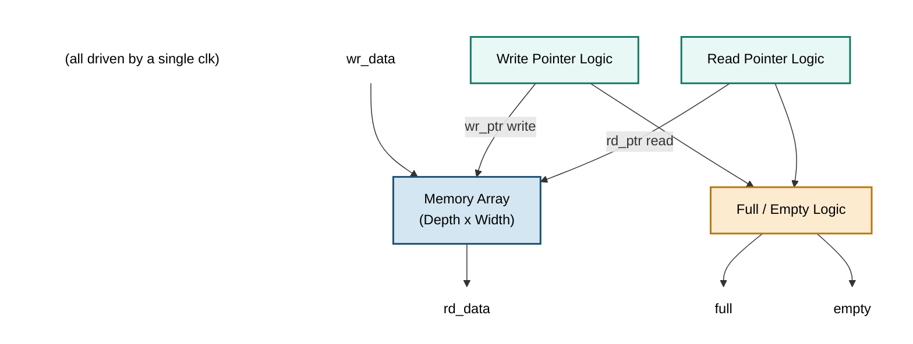

# Synchronous FIFO (First-In-First-Out) Memory

A parameterized, synthesizable **Synchronous FIFO** design written in Verilog/SystemVerilog. A synchronous FIFO uses a **single clock domain** for both read and write operations, making it one of the most fundamental building blocks in digital design — used to buffer data, decouple producer/consumer timing, and smooth out bursty data flow.

## Overview

A FIFO (First-In-First-Out) buffer is a memory structure where data is written in a particular order and read out in the **same order**. In a **synchronous FIFO**, both the write and read operations are governed by the **same clock**, unlike an asynchronous FIFO which uses two independent clocks and requires clock-domain-crossing (CDC) synchronization (e.g., Gray-coded pointers).

Synchronous FIFOs are simpler to design and verify because there is no metastability risk between domains — all logic operates on one clock edge.

---

## Features

- ✅ Fully synchronous design (single clock, single reset)
- ✅ Parameterizable **Data Width** and **FIFO Depth**
- ✅ Separate **Write Enable (`wr_en`)** and **Read Enable (`rd_en`)** control signals
- ✅ **Full** and **Empty** status flags
- ✅ Optional **Almost Full** / **Almost Programmable Full** and **Almost Empty** thresholds
- ✅ Overflow and underflow protection (writes blocked when full, reads blocked when empty)
- ✅ Simple **binary read/write pointers** (no Gray code needed — single clock domain)
- ✅ Register-based or Block RAM (BRAM) inferable storage
- ✅ Synthesizable on FPGA (Xilinx/Intel) and ASIC flows
- ✅ Easily testable with a simple self-checking testbench

---
 
## Block Diagram
 

---

## Logic Explanation

### Pointers

The FIFO maintains two pointers:

| Pointer | Purpose | Increments On |
|---------|---------|----------------|
| `wr_ptr` | Points to the next memory location to write | `wr_en && !full` |
| `rd_ptr` | Points to the next memory location to read | `rd_en && !empty` |

Both pointers are `log2(DEPTH)`-bit counters that wrap around (modulo `DEPTH`). To distinguish **full** from **empty** (both of which occur when `wr_ptr == rd_ptr`), an extra **MSB (wrap bit)** is added to each pointer:

- If the wrap bits are **equal** and the lower bits are equal → FIFO is **empty**
- If the wrap bits **differ** and the lower bits are equal → FIFO is **full**

### Full and Empty Flag Generation

```
empty = (wr_ptr == rd_ptr)

full  = (wr_ptr[MSB]      != rd_ptr[MSB]) &&
        (wr_ptr[MSB-1:0]  == rd_ptr[MSB-1:0])
```

This extra-bit trick avoids needing an explicit up/down counter for "number of elements," while still cleanly resolving the full/empty ambiguity.

### Read/Write Operation

1. **Write**: On the rising clock edge, if `wr_en` is asserted and the FIFO is **not full**, `wr_data` is written into `mem[wr_ptr]`, and `wr_ptr` increments.
2. **Read**: On the rising clock edge, if `rd_en` is asserted and the FIFO is **not empty**, `mem[rd_ptr]` is presented on `rd_data`, and `rd_ptr` increments.
3. Both operations can happen **simultaneously** in the same cycle (simultaneous read and write), since they act on independent memory locations.
4. If `wr_en` is high while `full` is high, the write is **ignored** (overflow protection).
5. If `rd_en` is high while `empty` is high, the read is **ignored** (underflow protection).


## Waveform / Simulation Behavior

| Cycle | wr_en | rd_en | wr_ptr | rd_ptr | full | empty | Event |
|-------|-------|-------|--------|--------|------|-------|-------|
| 0 | 0 | 0 | 0 | 0 | 0 | 1 | Reset state |
| 1 | 1 | 0 | 1 | 0 | 0 | 0 | Write data |
| 2 | 1 | 0 | 2 | 0 | 0 | 0 | Write data |
| 3 | 0 | 1 | 2 | 1 | 0 | 0 | Read data |
| 4 | 1 | 1 | 3 | 2 | 0 | 0 | Simultaneous read/write |
| ... | 1 | 0 | DEPTH | ... | 1 | 0 | FIFO full — further writes blocked |

---

## Real World Applications

- **CPU–Peripheral Data Buffering**: UART, SPI, and I2C controllers use small synchronous FIFOs to buffer transmit/receive data between the CPU and slower serial interfaces.
- **Network Switches/Routers**: Packet buffering between line cards operating on the same clock domain before switching fabric processing.
- **Audio/Video Streaming Pipelines**: Smoothing data rate mismatches between a producer (e.g., a decoder) and a consumer (e.g., a DAC) operating on the same clock.
- **DSP Pipelines**: Buffering intermediate samples between filter stages, FFT blocks, or convolution engines.
- **Producer-Consumer Rate Matching**: When a data source bursts data faster than a downstream block can consume it (or vice versa), a FIFO absorbs the burst.
- **On-chip Bus Bridges**: AXI-Stream, Avalon-ST, and similar streaming bus protocols use FIFOs internally for back-pressure handling.
- **Memory Controllers**: Command/response queues between the memory controller core and the DDR PHY logic (single clock domain sections).
- **Test and Debug Infrastructure**: Trace buffers and logic-analyzer capture buffers in FPGAs/SoCs.
- **Instruction/Micro-op Queues**: In CPU pipelines, decoded micro-ops are queued in FIFOs before dispatch to execution units.

---

## Synthesis Notes

- For **shallow FIFOs** (a few entries), the memory array typically synthesizes to **distributed RAM / registers (LUTRAM)**.
- For **deep FIFOs**, tools infer **Block RAM (BRAM)** automatically if written in the standard inference-friendly style shown above.
- Use `rd_en` gating carefully — if `rd_data` should hold its value when not reading, keep the `else` branch absent (as shown) rather than assigning `'0`.
- Consider adding **almost-full / almost-empty** flags with a programmable threshold for systems needing early back-pressure signaling.
- This design assumes a **single clock domain**. For crossing clock domains, use an **asynchronous FIFO** with Gray-coded pointers and dual-flop synchronizers instead.

---

## License

This design is provided under the MIT License — free to use, modify, and distribute.
